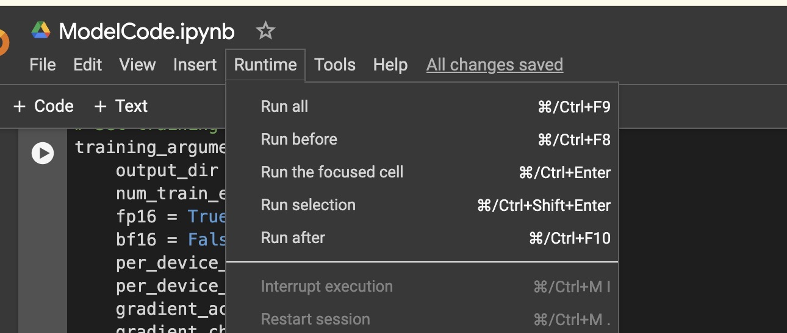

# README for Clinical Trials Dataset Conversion and Analysis

## Overview

This repository contains the tools and workflows for converting clinical trials data from JSON to a more compact and efficient .parquet format. The dataset used comprises the top 2000 records from [ClinicalTrials.gov](https://clinicaltrials.gov/search). The purpose of this conversion is to facilitate faster data processing and model training phases in Model learning process.

## Dataset Description

The original dataset was obtained from [ClinicalTrials.gov](https://clinicaltrials.gov/search), including detailed information on various clinical studies. The dataset was transformed from JSON format to .parquet, which provides efficient data storage and rapid access.

The Code is available here [GitHub repository](https://github.com/sanchit339/Raykor).

## Conversion Details

### Example JSON Entry

Below is a short example of a JSON entry in the dataset:
```json
{
    "identificationModule": {
        "nctId": "NCT06390072",
        "orgStudyIdInfo": {
            "id": "23-X-71"
        },
        "briefTitle": "Project Hypnos: The Impact of a Brief Hypnosis Intervention on Single-limb Dynamic Balance in People With Chronic Ankle Instability"
    }
}
```

### Converted Text Record

The JSON data is converted into the following text format for simplicity and ease of use:
```
identificationModule nctId: NCT06390072, orgStudyIdInfo id: 23-X-71, briefTitle: Project Hypnos: The Impact of a Brief Hypnosis Intervention on Single-limb Dynamic Balance in People With Chronic Ankle Instability,
```

### Final Data Storage

The final converted .parquet file is hosted on [HuggingFace Datasets](https://huggingface.co/datasets/hackint0sh/small-data) for easy access and integration into data pipelines.

## Model Training and Inference

### Computing Requirements

- **Download Time:** The code takes approximately 2-3 minutes to download and load the necessary libraries.
- **Training Time:** Training time varies depending on the GPU memory available.
- **Memory Management:** The current script utilizes the maximum available GPU memory, which can be adjusted by modifying the `batch_size` parameter.

### Running the Model

To run the model:
1. Open the provided Google Colab notebook: [Run Inference Notebook](https://colab.research.google.com/drive/1Bnzy_lzENKtJBWWia7qsbnolLLQ0ec6U?usp=sharing).
2. The Runtime for the current model in freetier is t4 GPU with memory of 16 gb.
3. Click on `Run All` in the toolbar to execute all cells (see included image for reference).
<br>

### Post-Training

After the model is fine-tuned on the dataset, you can provide a prompt to generate specific outputs based on the learned patterns.

## Usage Instructions

For developers and data scientists looking to utilize this pipeline:
- Ensure you have access to a GPU for faster processing.
- Follow the instructions in the Google Colab notebook to fine-tune and deploy the model.
- Adjust `batch_size` as necessary to fit your hardware capabilities without exceeding GPU memory limits.
